  

# Gabriel Marcondes

### Data Scientist · Full-Stack Developer · AI Engineer

*Building intelligent systems — from neural networks to production APIs*

## About Me

I'm a **Systems Analyst and Full-Stack Developer** (Project Lead) at T2S Tecnologia, where I design and build the **HRelper** ATS platform end-to-end. My work sits at the intersection of **software engineering** and **data science** — I architect scalable backends, optimize algorithms, and apply machine learning to real-world problems.

- 🔬 Engineered **HNSW vector search** for AI embeddings, taking candidate matching from O(n) → O(log n)
- ⚡ Delivered a **2.5× dashboard performance boost** and **50% memory reduction** through backend refactoring
- 🎓 Data Science Technologist — Fatec Baixada Santista
- 🌍 English C2 | Native Portuguese

## Tech Stack

### Languages

### Front-end

### Back-end & Infrastructure

### Data Science & AI

## Get in Touch

